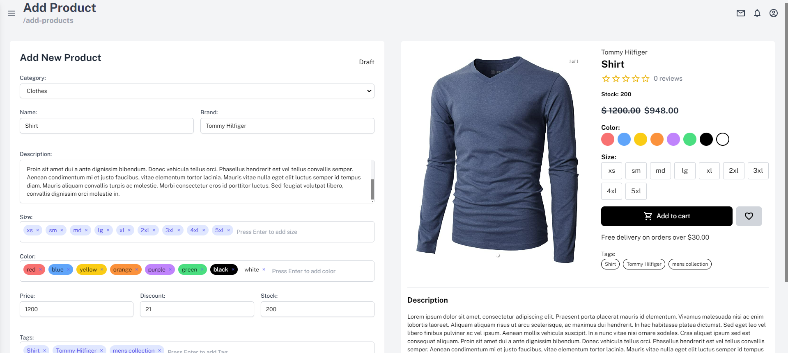
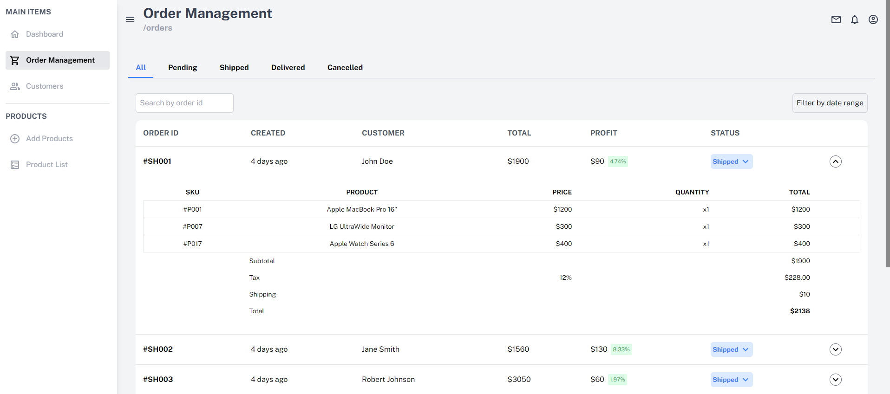

**Manage360** is a comprehensive Business Management System designed to streamline and optimize the management of orders, customers, and products. It includes a powerful dashboard that provides real-time analytics, helping businesses make informed decisions.


## 🚀 Features

- **Order Management**: View and manage orders with statuses like shipped, canceled, pending, and delivered.
- **Customer Management**: Easily access customer information and track customer activity.
- **Product Management**: Add, view, and remove products from the inventory with ease.
- **Dashboard**: Get detailed insights and analytics on business performance.

## 🛠️ Tech Stack

- **Frontend**: React, Tailwind CSS, Vite
- **State Management**: Redux Toolkit
- **Backend**: JSON Server for mock API
- **UI Components**: Material-UI Icons
- **Animation**: React Spring

## 📂 Project Structure

```plaintext
├── src
│   ├── features
│   │   ├── customer
│   │   ├── dashboard
│   │   ├── orderManagement
│   │   ├── products
│   │   └── user
│   ├── helper
│   ├── ui
│   └── App.jsx
│   └── index.jsx
├── data
│   ├── orders.json
│   └── users.json
├── public
└── package.json
```

## 🔧 Installation

1. **Clone the repository**:
   ```bash
   git clone https://github.com/KarimAdel-1/manage360.git
   cd manage360
   ```

2. **Install dependencies**:
   ```bash
   npm install
   ```

3. **Start the development server**:
   ```bash
   npm run dev
   ```

4. **Run the JSON servers**:
   - For orders:
     ```bash
     npm run server:orders
     ```
   - For users:
     ```bash
     npm run server:users
     ```

5. **View the application**:
   Open your browser and navigate to `http://localhost:5173` to view the application.

## 📸 Screenshots

### Add New Product


### Order Management


## 🤝 Contributing

Contributions are welcome! Please feel free to submit a Pull Request or open an issue.
